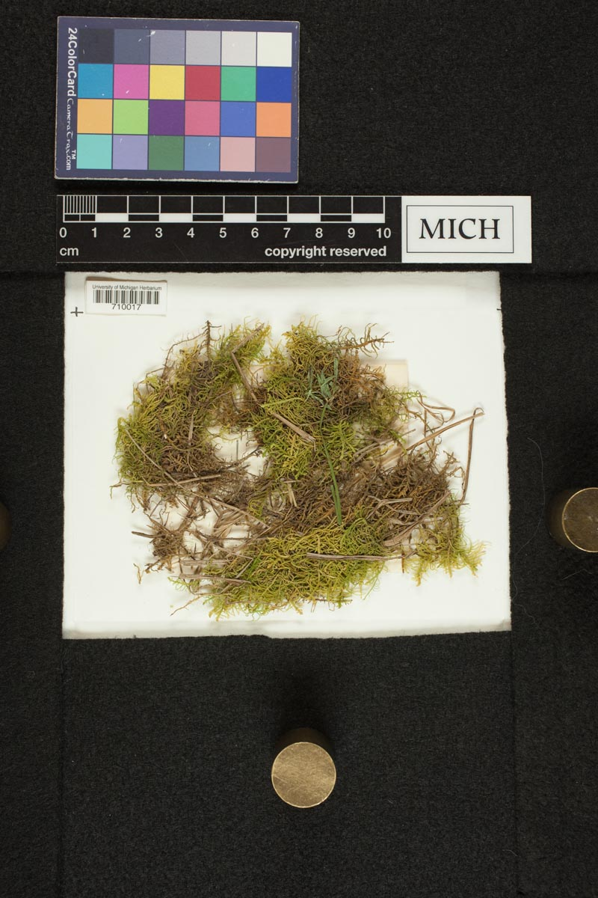
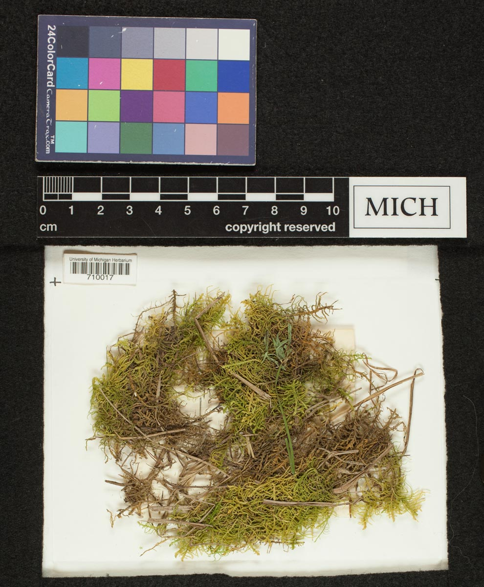
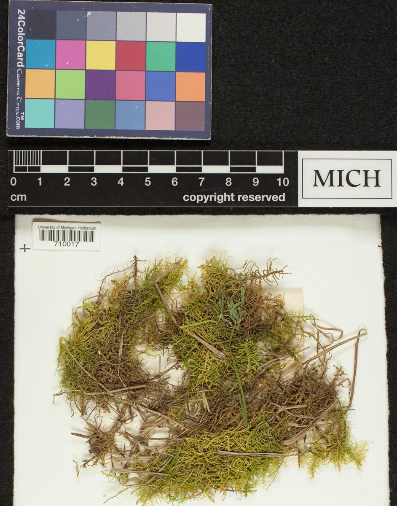
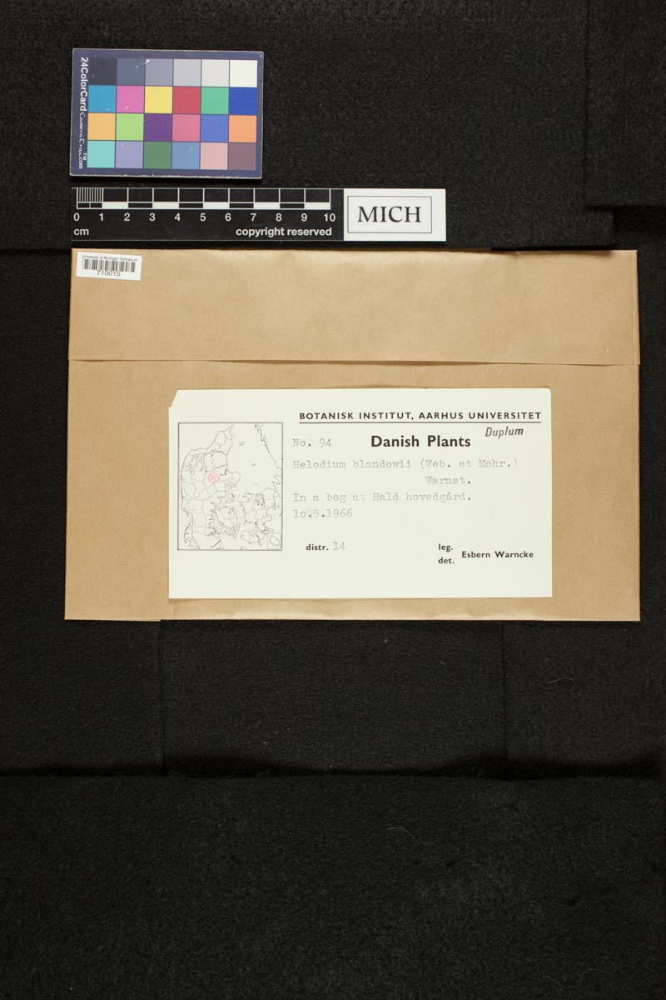
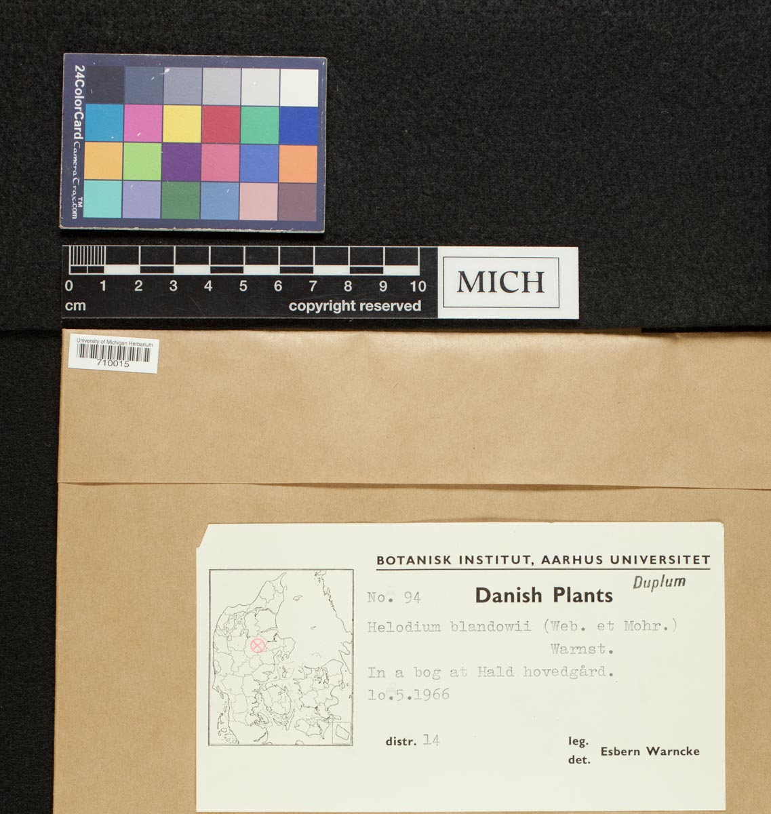
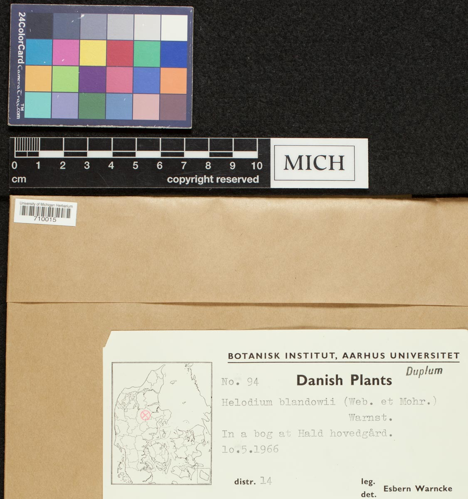

[](https://LeafMachine.org/)

Table of Contents
=================

* [Updates (March 25, 2024)](#updates-march-25-2024)
* [Installing LeafMachine2](#installing-leafmachine2)
   * [Prerequisites](#prerequisites)
   * [Hardware](#hardware)
   * [Installation - Cloning the LeafMachine2 Repository](#installation---cloning-the-leafmachine2-repository)
   * [About Python Virtual Environments](#about-python-virtual-environments)
   * [Installation - Ubuntu 20.04+](#installation---ubuntu-2004)
      * [Virtual Environment](#virtual-environment)
      * [Installing Packages](#installing-packages)
   * [Installation - Windows 10+](#installation---windows-10)
      * [Virtual Environment](#virtual-environment-1)
      * [Installing Packages](#installing-packages-1)
   * [Troubleshooting CUDA](#troubleshooting-cuda)
* [Testing the LeafMachine2 Installation](#testing-the-leafmachine2-installation)
* [Using LeafMachine2 GUI](#using-leafmachine2-gui)
* [Creating a Desktop Shortcut](#creating-a-desktop-shortcut)
* [Using LeafMachine2](#using-leafmachine2)
   * [LeafMachine2 Data Cleaning and Prep (preprocessing steps to be aware of)](#leafmachine2-data-cleaning-and-prep-preprocessing-steps-to-be-aware-of)
   * [LeafMachine2 Configuration File](#leafmachine2-configuration-file)
      * [Quick Start](#quick-start)
      * [Primary options (project)](#primary-options-project)
      * [Secondary (project)](#secondary-project)
      * [Primary options (cropped_components)](#primary-options-cropped_components)
      * [Primary options (data)](#primary-options-data)
      * [Primary options (overlay)](#primary-options-overlay)
      * [Primary options (plant_component_detector)](#primary-options-plant_component_detector)
      * [Primary options (archival_component_detector)](#primary-options-archival_component_detector)
      * [Primary options (landmark_detector)](#primary-options-landmark_detector)
      * [Primary options (ruler_detection)](#primary-options-ruler_detection)
      * [Primary options (leaf_segmentation)](#primary-options-leaf_segmentation)
   * [SpecimenCrop Configuration Guide](#specimencrop-configuration-guide)
      * [Before and After](#before-and-after)
      * [Example Workflow](#example-workflow)
      * [Important Arguments](#important-arguments)
      * [Configuration Settings](#configuration-settings)
   * [Downloading Images from GBIF](#downloading-images-from-gbif)
      * [An interactive Streamlit GUI is in the works, stay tuned!](#an-interactive-streamlit-gui-is-in-the-works-stay-tuned)


---

# Updates (March 25, 2024)
* March 25, 2024 :rocket:
    * Many, many changes. I recommend creating a new venv to use the updated LM2.
    * Added a Streamlit GUI
        * Run the `run_LeafMachine2.py` script to launch the GUI
        * Activate the virtual env, then `python run_LeafMachine2.py`
    * Fixed installation bugs
    * New PCD LeafPriority detector. This drammatically improves LeafMachine2's leaf detection ability and all other downstream components. Please see [the LeafMachine2 website for more information](https://leafmachine.org/). The new PCD is the new default. The new model will be downloaded automatically when you update your installation with a `git pull` or with a clean installation. 

> **Note:** To get the latest updates, use `cd` to move into your LeafMachine2 directory, build and activate your virtual environment, then run `git pull`. We recommend rebuilding your venv from scratch for this update. If you made local changes to your repo, you may have to stash or --force overwrite your local changes (or just install LM2 in a new local directory).

# Installing LeafMachine2

## Prerequisites
- Validated with Python >= 3.8, <= 3.11 
- PyTorch 1.11 (Can work with PyTorch 2.X if you are willing to mess around with dependencies/CUDA)
- Git
- CUDA version 11.3 (if utilizing a GPU)
    * see [Troubleshooting CUDA](#Troubleshooting-CUDA)


## Hardware
- A GPU with at least 8 GB of VRAM is required
- LeafMachine2 v.2.1 is RAM limited. A batch size of 50 images could potentially utilize 48 GB+ of system memory. Setting batch sizes to 20 will only increase the number of summary and data files, but performance speed differences are minimal.
- The PCD confidence threshold dictates RAM usage. More leaves detected -> more RAM to store more leaves and derived measurements until they are saved to batch files and summary images. 
- The number of leaves per image dictates RAM usage. Taxa with hundred of leaves per image (e.g. _Diospyros buxifolia_) will require much more RAM than taxa with few leaves per image (e.g. _Quercus alba_)
- For most PCs, set the number of workers to 2 or 4. If you have a high performance PC with 128 GB+ of RAM and a powerful CPU, then 8 workers and batch sizes of 100+ are possible. 
> **Note:** An average PC with 32 GB of RAM and a consumer-grade GPU is more than capable of running LeafMachine2, just dial back the batch size. With the right configs, a PC with 16 GB of RAM can run LeafMachine2 if the batch size is set to 10 or 20. 

## Installation - Cloning the LeafMachine2 Repository
1. First, install Python 3.8.10, or greater, on your machine of choice.
    - Make sure that you can use `pip` to install packages on your machine, or at least inside of a virtual environment.
    - Simply type `pip` into your terminal or PowerShell. If you see a list of options, you are all set. Otherwise, see
    either this [PIP Documentation](https://pip.pypa.io/en/stable/installation/) or [this help page](https://www.geeksforgeeks.org/how-to-install-pip-on-windows/)
2. Open a terminal window and `cd` into the directory where you want to install LeafMachine2.
3. Clone the LeafMachine2 repository from GitHub by running `git clone https://github.com/Gene-Weaver/LeafMachine2.git` in the terminal.
4. Move into the LeafMachine2 directory by running `cd LeafMachine2` in the terminal.
5. To run LeafMachine2 we need to install its dependencies inside of a python virtual environmnet. Follow the instructions below for your operating system. 

## About Python Virtual Environments
A virtual environment is a tool to keep the dependencies required by different projects in separate places, by creating isolated python virtual environments for them. This avoids any conflicts between the packages that you have installed for different projects. It makes it easier to maintain different versions of packages for different projects.

For more information about virtual environments, please see [Creation of virtual environments](https://docs.python.org/3/library/venv.html)

<!-- > We include `requirements.txt` files in the `LeafMachine2/requirements/` folder. If you experience version incompatability following the instructions below, please refer to `LeafMachine2/requirements/requirements_all.txt` for an exhaustive list of packages and versions that are officially supported.  -->

---

## Installation - Ubuntu 20.04+

Quick installation: Inside of a python virtual environment, `pip install -r requirements.txt`, then `pip install torch==1.11.0+cu113 torchvision==0.12.0+cu113 torchaudio==0.11.0 --extra-index-url https://download.pytorch.org/whl/cu113`

For more detailed instructions, see below. 

### Virtual Environment

1. Still inside the LeafMachine2 directory, show that a venv is currently not active 
    <pre><code class="language-python">which python</code></pre>
    <button class="btn" data-clipboard-target="#code-snippet"></button>
2. Then create the virtual environment (venv_LM2 is the name of our new virtual environment)  
    <pre><code class="language-python">python -m venv venv_LM2</code></pre>
    <button class="btn" data-clipboard-target="#code-snippet"></button>
3. Activate the virtual environment  
    <pre><code class="language-python">source ./venv_LM2/bin/activate</code></pre>
    <button class="btn" data-clipboard-target="#code-snippet"></button>
4. Confirm that the venv is active (should be different from step 1)  
    <pre><code class="language-python">which python</code></pre>
    <button class="btn" data-clipboard-target="#code-snippet"></button>
5. If you want to exit the venv, deactivate the venv using  
    <pre><code class="language-python">deactivate</code></pre>
    <button class="btn" data-clipboard-target="#code-snippet"></button>

### Installing Packages
1.  First, update pip, wheel, setuptools
    With the venv active, install wheel 
        <pre><code class="language-python">python -m pip install wheel</code></pre>
        <button class="btn" data-clipboard-target="#code-snippet"></button>
    Update pip and setuptools
        <pre><code class="language-python">python -m pip install --upgrade pip setuptools</code></pre>
        <button class="btn" data-clipboard-target="#code-snippet"></button>

2. Install the required dependencies to use LeafMachine2  
    <pre><code class="language-python">pip install -r requirements.txt</code></pre>
    <button class="btn" data-clipboard-target="#code-snippet"></button>
3. Install pycococreator
    <pre><code class="language-python">pip install git+https://github.com/waspinator/pycococreator.git@fba8f4098f3c7aaa05fe119dc93bbe4063afdab8#egg=pycococreatortools</code></pre>
    <button class="btn" data-clipboard-target="#code-snippet"></button>
4. Install COCO annotation tools and a special version of Open CV
    <pre><code class="language-python">pip install pycocotools>=2.0.5 opencv-contrib-python>=4.7.0.68</code></pre>
    <button class="btn" data-clipboard-target="#code-snippet"></button>
5. LeafMachine2 algorithms require PyTorch version 1.11 for CUDA version 11.3+. If your computer does not have a GPU, then use the CPU version and the CUDA version is not applicable. PyTorch is large and will take a bit to install.
    - WITH GPU 
    <pre><code class="language-python">pip install torch==1.11.0+cu113 torchvision==0.12.0+cu113 torchaudio==0.11.0 --extra-index-url https://download.pytorch.org/whl/cu113</code></pre>
    <button class="btn" data-clipboard-target="#code-snippet"></button>
    OR 
    <pre><code class="language-python">pip install torch==2.3.0 torchvision==0.18.0 torchaudio==2.3.0 --index-url https://download.pytorch.org/whl/cu121</code></pre>
    <button class="btn" data-clipboard-target="#code-snippet"></button>
    
    <!-- - For a newer version of CUDA, like CUDA 12.1, you can install the most recent version:
    <pre><code class="language-python">install torch torchvision torchaudio
    </code></pre>
    <button class="btn" data-clipboard-target="#code-snippet"></button> -->

6. Install ViT for PyTorch. ViT is used for segmenting labels and rulers. The DocEnTr framework that we use for document image segmentation requires an older verison of ViT, the most recent version will cause an error. 
    <pre><code class="language-python">pip install vit-pytorch==0.37.1</code></pre>
    <button class="btn" data-clipboard-target="#code-snippet"></button>

> If you need help, please submit an inquiry in the form at [LeafMachine.org](https://LeafMachine.org/)

---

## Installation - Windows 10+

Quick installation: Inside of a python virtual environment, `pip install -r requirements.txt`, then `pip install torch==1.11.0+cu113 torchvision==0.12.0+cu113 torchaudio==0.11.0 --extra-index-url https://download.pytorch.org/whl/cu113`, then `pip install pywin32`.

For more detailed instructions, see below. 

### Virtual Environment

1. Still inside the LeafMachine2 directory, show that a venv is currently not active 
    <pre><code class="language-python">python --version</code></pre>
    <button class="btn" data-clipboard-target="#code-snippet"></button>
2. Then create the virtual environment (venv_LM2 is the name of our new virtual environment. You must name it "venv_LM2" if you want to use the Desktop shortcut)  
    <pre><code class="language-python">python -m venv venv_LM2</code></pre>
    <button class="btn" data-clipboard-target="#code-snippet"></button>
3. Activate the virtual environment  
    <pre><code class="language-python">.\venv_LM2\Scripts\activate</code></pre>
    <button class="btn" data-clipboard-target="#code-snippet"></button>
4. Confirm that the venv is active (should be different from step 1)  
    <pre><code class="language-python">python --version</code></pre>
    <button class="btn" data-clipboard-target="#code-snippet"></button>
5. If you want to exit the venv, deactivate the venv using  
    <pre><code class="language-python">deactivate</code></pre>
    <button class="btn" data-clipboard-target="#code-snippet"></button>

### Installing Packages

1. Install the required dependencies to use LeafMachine2  
    <pre><code class="language-python">pip install -r requirements.txt</code></pre>
    <button class="btn" data-clipboard-target="#code-snippet"></button>
2. Install pycococreator
    <pre><code class="language-python">pip install git+https://github.com/waspinator/pycococreator.git@fba8f4098f3c7aaa05fe119dc93bbe4063afdab8#egg=pycococreatortools</code></pre>
    <button class="btn" data-clipboard-target="#code-snippet"></button>
3. Install COCO annotation tools, a special version of Open CV, and pywin32 for creating the desktop shortcut
    <pre><code class="language-python">pip install pywin32 pycocotools>=2.0.5 opencv-contrib-python>=4.7.0.68</code></pre>
    <button class="btn" data-clipboard-target="#code-snippet"></button>
4. LeafMachine2 algorithms require PyTorch version 1.11 for CUDA version 11.3+. If your computer does not have a GPU, then use the CPU version and the CUDA version is not applicable. PyTorch is large and will take a bit to install.
    - WITH GPU 
    <pre><code class="language-python">pip install torch==1.11.0+cu113 torchvision==0.12.0+cu113 torchaudio==0.11.0 --extra-index-url https://download.pytorch.org/whl/cu113</code></pre>
    <button class="btn" data-clipboard-target="#code-snippet"></button>
    <!-- - For a newer version of CUDA, like CUDA 12.1, you can install the most recent version:
    <pre><code class="language-python">pip install torch torchvision torchaudio --index-url https://download.pytorch.org/whl/cu121
    </code></pre>
    <button class="btn" data-clipboard-target="#code-snippet"></button> -->

5. Install ViT for PyTorch. ViT is used for segmenting labels and rulers. The DocEnTr framework that we use for document image segmentation requires an older verison of ViT, the most recent version will cause an error. 
    <pre><code class="language-python">pip install vit-pytorch==0.37.1</code></pre>
    <button class="btn" data-clipboard-target="#code-snippet"></button>

> If you need help, please submit an inquiry in the form at [LeafMachine.org](https://LeafMachine.org/)

---

## Troubleshooting CUDA
- CUDA issues can be extremely frustrating. 
- Start by finding your current CUDA version or installing the most recent CUDA version that is compatible with your GPU. 
- Try installing the old version of PyTorch listed in these docs.
- If that works, great! If not, you can install the [latest pytorch release](https://pytorch.org/get-started/locally/) for your specific OS and CUDA version.
- If that fails, you might have a CUDA installation issue. 
- If you cannot get the GPU working, then you can install PyTorch with CPU only, avoiding the CUDA problem entirely, but that is not recommended given that 
LeafMachine2 is designed to use GPUs. The components that rely on ViT (binarization of labels) will *NOT* work without a GPU. The leaf segmentation may not work either, sometimes it does, sometimes not. 
- We have also validated CUDA 12.4 with PyTorch 2.X. If you have success with other versions of CUDA/pytorch, let us know and we will update our instructions. 

---

# Testing the LeafMachine2 Installation
Assuming no errors with the previous instructions, we can now test LeafMachine2 and make sure that everything is funtional. There are two options for working with LeafMachine2. 

If you plan to mostly use it with default setting, then working from the terminal (or PowerShell) will be fine. 

We recommend using [Microsoft Visual Studio Code](https://code.visualstudio.com/download) (or another IDE e.g. Sublime, PyCharm...) since LeafMachine2 relies on configuration files. Editing config files in an IDE helps reduce syntax mistakes, plus it's just easier to work with. 

If you plan on changing lots of settings, we recommend running LeafMachine2 in debug mode (in the IDE, LM2 does not have a debug mode). It won't hurt anything, and it will show you more information about any errors. We log and handle errors, but not all errors fail gracefully and inevitably there will be some novel errors as we continue to refine LeafMachine2. 

1. When you first run LeafMachine2, it must download all of the machine learning files that are not stored on GitHub. You will see white text in the console indicating progress or failure. 
    - If LM2 displays an error while downloading the networks, first try to run `test.py` described below.
        * Note: If you attempt to download the ML networks multiple times, you may see error messages, but often the networks were successfully downloaded anyway. 
    - If you still have trouble, submit your log file (or all files) to [LeafMachine2 Logs](https://docs.google.com/forms/d/e/1FAIpQLSdTOBBt4LNQBy9NPzxGFXGywwJoc52YGcVTY9dO6VKM1iz0Fw/viewform?usp=sf_link) for assistance. 
2. In the future, we will release updated ML networks. This system will also handle updates. 
3. We have included demo images and a test file to make sure that all components are functional. The demo images are in `../LeafMachine2/demo/demo_images/` and all output from the test will go to `../LeafMachine2/demo/demo_output/`. After a successful test, you can delete the contents of `demo_output/` if you want, or keep it as a reference. 
    - The demo will run all components of LeafMachine2, including some features that you may not want. For example, the demo will test skeletonization of the labels and rulers, so in the folder `../LeafMachine2/demo/demo_output/test_run/Cropped_Images/By_Class/label_binary` you will see strange looking labels, but that is intentional. 
4. Running the installation test (from the terminal)
    - make sure that the virtual environment is active and that the virtual environment is located inside the LM2 home directory: `LeafMachine2/venv_LM2`
    - cd into the LeafMachine2 directory
    <pre><code class="language-python">python test.py</code></pre>
    <button class="btn" data-clipboard-target="#code-snippet"></button>
    or
    <pre><code class="language-python">python3 test.py</code></pre>
    <button class="btn" data-clipboard-target="#code-snippet"></button>
    - You should see some blue text, and then a lot of information in the console. 
    - If the run completes (usually after ~5 minutes) and you see a :grinning: then you should be all set!
    - Otherwise, double check that you followed each step and reach out by submitting an inquiry in the form at [LeafMachine.org](https://LeafMachine.org/)

---

# Using LeafMachine2 GUI

As of March 18, 2024 LeafMachine2 has a Stramlit GUI. To launch the GUI, run:
<pre><code class="language-python">python run_LeafMachine2.py</code></pre>
<button class="btn" data-clipboard-target="#code-snippet"></button>
This will open a new tab in your browser with a simple user interface. Please refer to the guide below for more information about how everything works.
The GUI has most of the setting described below and is a great place to start. 

> **Note:** If you previously installed LeafMachine2, we recommend rebuilding your venv from scratch before trying to run the latest updates. To get the latest updates, use `cd` to move into your LeafMachine2 directory, build and activate your virtual environment, then run `git pull`. If you made local changes to your repo, you may have to stash or --force overwrite your local changes (or just install LM2 in a new local directory).

# Creating a Desktop Shortcut

For Windows installations, you can create a desktop shortcut to launch the GUI. Activate your virtual environment, then run `python create_desktop_shortcut.py`. In the terminal you will need to follow the instructions by selecting the location where you want to save the shortcut, and then selecting the virtual environment's folder `venv_LM2`. Your shortcut should appear. 


# Using LeafMachine2

For most applications, you only need to be aware of two files:
- `LeafMachine2.py`
    * The file to run LeafMachine2
- `LeafMachine2.yaml`
    * The configuration file for LeafMachine2

To run LeafMachine2...
- From the terminal
    * cd into the `./LeafMachine2` directory
    * make sure that the virtual environment is active
    * run the python file
    <pre><code class="language-python">python3 LeafMachine2.py</code></pre>
    <button class="btn" data-clipboard-target="#code-snippet"></button>
    or
    <pre><code class="language-python">python LeafMachine2.py</code></pre>
    <button class="btn" data-clipboard-target="#code-snippet"></button>
- From an IDE like VS Code
    * open the `./LeafMachine2` directory
    * locate the `LeafMachine2.py` file
    * run the file (in debug mode if you want)
- That's it!

Well almost. We also need to setup our [configuration file](#LeafMachine2-Configuration-File). 

---

## LeafMachine2 Data Cleaning and Prep (preprocessing steps to be aware of)
LeafMachine **WILL** automatically edit illegal characters out of file names and replace them with `_` or `-`.

Illegal characters in file names include anything that is not a letter or number or `_` or `-`.

Secifically, we use this function to clean names:
```python
name_cleaned = re.sub(r"[^a-zA-Z0-9_-]","-",name)
```
Spaces will become `_`.

Also, all images will be rotated to be vertical - downstream processes rely on this. This check will also **delete** any corrupt image files. We found that ~1/10,000 downloads from GBIF produce a corrupt file and this is how we chose to deal with it. 

* Illegal character replacement and image rotation can be turned off, but doing so will likely cause bad things to happen. Change these config settings to `False`:
```yaml
leafmachine:
    do:
        check_for_illegal_filenames: False 
        check_for_corrupt_images_make_vertical: False
```

> If these processing steps sound like they will significantly impact your raw images, then *please* make sure that you have back up copies of your original images. If you downloaded your images from GBIF, this should not be a worry. But if you are processing your own custom images, then please only run LeafMachine2 on copies of the original images. No one has a good day if a file is deleted! If you have concerns please reach out [LeafMachine.org](https://LeafMachine.org/).

> If your taxa names (the actual file name) have special characters, LeafMachine2 will replace them with `-`. Python code in general does not play nice with characters like:
> * Viola lutea x tricolor x altaica  :arrow_right:  Viola_lutea_x_tricolor_x_altaica  
> * Viola lutea x tricolor x altaica  :arrow_right:  Viola_lutea_-_tricolor_-_altaica  (if the X is not the letter X)
> * Dichondra sp. Inglewood (J.M.Dalby 86/93)  :arrow_right:  Dichondra_sp-_Inglewood_-J.M.Dalby_86-93-
> * Sida sp. Musselbrook (M.B.Thomas+ MRS437)  :arrow_right: Sida_sp-_Musselbrook_-M-B-Thomas-_MRS437-

> These special characters should not be used in file names (in general, not just for LeafMachine2). 

Having spaces in names or directories can cause unexpected problems.
* :heavy_check_mark: `./dir_names_with_underscores/file_name_with_underscores`
* :heavy_check_mark: `./dir-names-with-dashes/file-name-with-dashes`
* :x: `./not great dir names/not great file names`

---

## LeafMachine2 Configuration File
Now you can run LeafMachine2, but unless you setup the configuration file, nothing will happen! LeafMachine2 has many many configurable settings. Here we will outline settings that most folks will use. The `LeafMachine2.yaml` file is grouped by component, but not all settings within a component group need to be (or should be) modified. 

Most settings dictate which output files LeafMachine2 will save. Some dictate how many leaves will be extracted or which ML networks will be used.

To change settings in the `LeafMachine2.yaml` file we recommend using a VS Code or another IDE  because they will help reduce errors. But any plain text editor will work (e.g. Notepad on Windows)

Open the file and customize the options described below. 

### Quick Start
The most important setting are marked with a :star:. Begin with these settings and then explore adjusting other settings (if needed).

### Primary options (project)
:star: Settings that tell LeafMachine2 where things are and where you want to save output files.

Strings must be inside '' or "". Forgetting them, or missing one, will cause errors.

Type `null` for the default value.

Pointing to directories. 
```yaml
leafmachine:
    project:
        dir_output: '/full/path/to/output/directory' # LeafMachine2 will build the output dir structure here
        run_name: 'informative_run_name' # LeafMachine2 will build the output dir structure here
        dir_images_local: '/full/path/to/directory/containing/images' # This can also be a dir with subdirs
```

Set `image_location` to `'local'` if you already have images, or to `'GBIF'` if you will configure LM2 to download the images.

More information about downloading images [here](#Downloading-Images-from-GBIF).
```yaml
leafmachine:
    project:
        image_location: 'local' # str |FROM| 'local' or 'GBIF' # 
        GBIF_mode: 'all' 
```

:star: Batch processing. Set based on PC hardware. We recommend 64 GB of RAM for `batch_size: 50` and `num_workers: 4`. 

On your first run, set `batch_size: 5 num_workers: 2` jsut to make sure everything is working, then increase to taste. 
```yaml
leafmachine:
    project:
        batch_size: 50 # default = 20
        num_workers: 2 # default = 2
```

### Secondary (project)
These are less common options. Do not change unless you need to. Set to `null` if not in use. 

These settings will find the GBIF images and occurrence CSV files, create a combined.csv file, and enable you to merge these data with the LM2 output data files. Requires images to already be downloaded and `image_location: 'local'`. 
```yaml
leafmachine:
    project:
        path_combined_csv_local: '/full/path/to/save/location/of/run_name_combined.csv' # do set the name of the combined file here
        path_occurrence_csv_local: '/full/path/to/occurrence_csv' # just the dir that containes the txt or csv file
        path_images_csv_local: '/full/path/to/images_csv' # just the dir that containes the txt or csv file
```

If you are reprocessing the same group of images multiple times, you can point LM2 to the *first* ACD and PCD detection files to save time. This assumes that you want to use the same ACD and PCD detections each time. Set to `null` to tell LM2 to run ACD and PCD each time. 
```yaml
leafmachine:
    project:
        use_existing_plant_component_detections: '/full/path/to/output/directory/informative_run_name/Plant_Components/labels'
        use_existing_archival_component_detections: '/full/path/to/output/directory/informative_run_name/Archival_Components/labels'
```

This will allow you to select a random subset of a large image set. 

Setting `n_images_per_species: 10` will randomly pick 10 images from the species in 
`species_list: '/full/path/to/existing/species/names/10_images_per_species.csv'` 
and save them to `dir_images_subset: '/full/path/to/save/location/of/new/subset'`. 

Set `process_subset_of_images: True` to use, `process_subset_of_images: False` to skip.

The sepcies list is a CSV file with this format:
| species                           | count |
|----------------------------------|-------|
| Ebenaceae_Diospyros_virginiana   | 3263  |
| Ebenaceae_Diospyros_ferrea       | 614   |
| Ebenaceae_Diospyros_iturensis    | 552   |
| Ebenaceae_Diospyros_mespiliformis| 478   |
etc...
```yaml
leafmachine:
    project:
        process_subset_of_images: True
        dir_images_subset: '/full/path/to/save/location/of/new/subset'
        n_images_per_species: 10
        species_list: '/full/path/to/existing/species/names/10_images_per_species.csv' 
```

---
### Primary options (cropped_components)
Saves cropped RGB images based on detections from the ACD and PCD. 

:star: If you want to save none, set `do_save_cropped_annotations: False`

If you want to save all cropped images (which is heaps and heaps of images...), set `save_cropped_annotations: ['save_all']`

Use the template below to pick and choose classes to save. 
:star: Set `binarize_labels: True` to use a ViT ML network to clean labels and rulers. Note: this will binarize all classes in `save_cropped_annotations: ['label', 'ruler']`.

Set `binarize_labels_skeletonize: True` to skeletonize the binary image. Not useful for most situations. 
```yaml
leafmachine:
    cropped_components:
        # add to list to save, lowercase, comma seperated, in 'quotes'
        # archival |FROM| 
        #           ruler, barcode, colorcard, label, map, envelope, photo, attached_item, weights
        # plant |FROM| 
        #           leaf_whole, leaf_partial, leaflet, seed_fruit_one, seed_fruit_many, flower_one, flower_many, bud, specimen, roots, wood
        do_save_cropped_annotations: True
        save_cropped_annotations: ['label', 'ruler'] # 'save_all' to save all classes
        save_per_annotation_class: True # saves crops into class-names folders
        binarize_labels: True
        binarize_labels_skeletonize: False
```

---
### Primary options (data)
Configure data output. Currently, LM2 saves data to CSV files. JSON files are not going to be helpful for most situations. 

To apply the conversion factor to all measurements, set `do_apply_conversion_factor: True`

To include the DWC data in the output files, set `include_darwin_core_data_from_combined_file: True`
```yaml
leafmachine:
    data:
        save_json_rulers: False
        save_json_measurements: False
        save_individual_csv_files_rulers: False
        save_individual_csv_files_measurements: False
        include_darwin_core_data_from_combined_file: False
        do_apply_conversion_factor: True
```

---
### Primary options (overlay)
Configure the overlay settings for most of the summary output. 

:star: Set `save_overlay_to_pdf: True` to save each summary image to a PDF page. This is useful for keeping the number of total output files low.

:star: Set `save_overlay_to_jpgs: True` to save each summary image at full resolution.

Since we place roated bounding boxes around leaves, you can set `ignore_plant_detections_classes: ['leaf_whole', 'leaf_partial', 'specimen']` to hide the bounding boxes the come directly from the PCD. Same for `ignore_archival_detections_classes: []` and `ignore_landmark_classes: []`, but we recommend leaving them empty.

:star: Depending on your image size, you can increase or decrease these settings to change the thickness of overlay lines:
```yaml
        line_width_archival: 2 # int # thick = 6, thin = 1
        line_width_plant: 6 # int # thick = 6, thin = 1
        line_width_seg: 12 # int # thick = 12, thin = 1
        line_width_efd: 6 # int # thick = 6, thin = 1
```

These settings are a good starting point:
```yaml
leafmachine:
    overlay:
        save_overlay_to_pdf: True
        save_overlay_to_jpgs: True
        overlay_dpi: 300 # int |FROM| 100 to 300
        overlay_background_color: 'black' # str |FROM| 'white' or 'black'

        show_archival_detections: True
        ignore_archival_detections_classes: []
        show_plant_detections: True
        ignore_plant_detections_classes: ['leaf_whole', 'leaf_partial', 'specimen']
        show_segmentations: True
        show_landmarks: True
        ignore_landmark_classes: []

        line_width_archival: 2 # int
        line_width_plant: 6 # int
        line_width_seg: 12 # int # thick = 12
        line_width_efd: 6 # int # thick = 3
        alpha_transparency_archival: 0.3  # float between 0 and 1
        alpha_transparency_plant: 0
        alpha_transparency_seg_whole_leaf: 0.4
        alpha_transparency_seg_partial_leaf: 0.3
```

---
### Primary options (plant_component_detector)
:star: This is probably the most impactful setting in LM2: `minimum_confidence_threshold: 0.5 `
Higher values like `0.9` will detect fewer leaves, lower values like `0.10` will detect many leaves. 

Set `do_save_prediction_overlay_images: True` to save the YOLOv5 overlay images. These also show the bbox confidence and are useful for determining why some objects are not getting detected.

Set `ignore_objects_for_overlay: ['leaf_partial]` to hide predictions from the YOLOv5 overlay images. Can be useful for very cluttered images. Use the same names as in [Primary options (cropped_components)](#Primary-options-(cropped_components)) 

Do not change the detecor names. LM2 v.2.1 only include networks from the publication. Additional networks will be available in future releases. 
```yaml
leafmachine:
    plant_component_detector:
        # ./leafmachine2/component_detector/runs/train/detector_type/detector_version/detector_iteration/weights/detector_weights
        detector_type: 'Plant_Detector' 
        detector_version: 'PLANT_GroupAB_200'
        detector_iteration: 'PLANT_GroupAB_200'
        detector_weights: 'best.pt'
        minimum_confidence_threshold: 0.5 #0.2
        do_save_prediction_overlay_images: True
        ignore_objects_for_overlay: []
```

---
### Primary options (archival_component_detector)
:star: Archival components are detected exceptionally well. We have seen very few errors or problems with `minimum_confidence_threshold: 0.5` and recommend leaving this alone unless your images are substantially different from an average herbarium specimen. 

Set `do_save_prediction_overlay_images: True` to save the YOLOv5 overlay images. These also show the bbox confidence and are useful for determining why some objects are not getting detected.

Set `ignore_objects_for_overlay: ['label]` to hide predictions from the YOLOv5 overlay images. Can be useful for very cluttered images. Use the same names as in [Primary options (cropped_components)](#Primary-options-(cropped_components)) 

Do not change the detecor names. LM2 v.2.1 only include networks from the publication. Additional networks will be available in future releases. 
```yaml
leafmachine:
    archival_component_detector:
        # ./leafmachine2/component_detector/runs/train/detector_type/detector_version/detector_iteration/weights/detector_weights
        detector_type: 'Archival_Detector' 
        detector_version: 'PREP_final'
        detector_iteration: 'PREP_final'
        detector_weights: 'best.pt'
        minimum_confidence_threshold: 0.5
        do_save_prediction_overlay_images: True
        ignore_objects_for_overlay: []
```

---
### Primary options (landmark_detector)
:star: To enable landmark detection set `landmark_whole_leaves: True`. LM2 v.2.1 does not support landmark detection for partial leaves, so set `landmark_whole_leaves: False`. 

:star: Please refer to the publication for an explanation of why `minimum_confidence_threshold: 0.1` is set so low. We found this to be a happy spot, but tweaking the value up or down may improve results for some taxa. 

Set `do_save_prediction_overlay_images: True` to save the landmarking overlay images to a PDF file for review. *To show the landmark detections in the whole specimen summary images, this needs to be set to `True` too*. This applies to `do_save_final_images: True` as well.

Do not change the detecor names. LM2 v.2.1 only include networks from the publication. Additional networks will be available in future releases. 
```yaml
leafmachine:
    landmark_detector:
        # ./leafmachine2/component_detector/runs/train/detector_type/detector_version/detector_iteration/weights/detector_weights
        landmark_whole_leaves: True
        landmark_partial_leaves: False
        
        detector_type: 'Landmark_Detector_YOLO' 
        detector_version: 'Landmarks'
        detector_iteration: 'Landmarks'
        detector_weights: 'last.pt'
        minimum_confidence_threshold: 0.1
        do_save_prediction_overlay_images: True 
        ignore_objects_for_overlay: [] # list[str] # list of objects that can be excluded from the overlay # all = null
        use_existing_landmark_detections: null

        do_show_QC_images: False
        do_save_QC_images: True

        do_show_final_images: False
        do_save_final_images: True

```

---
### Primary options (ruler_detection)
:star: Set these to save different versions of ruler QC images:
```yaml
save_ruler_validation: False # the full QC image, includes the squarified image and intermediate steps
save_ruler_validation_summary: True  # the recommended QC image
save_ruler_processed: False # just the binary ruler
```
To limit conversion factor determination to highly confident rulers, set `minimum_confidence_threshold: 0.8`.
We find that `minimum_confidence_threshold: 0.4` is fine in general, though. 

Do not change the detecor names. LM2 v.2.1 only include networks from the publication. Additional networks will be available in future releases. 
```yaml
leafmachine:
    ruler_detection:
        detect_ruler_type: True # only True right now
        ruler_detector: 'ruler_classifier_38classes_v-1.pt'  # MATCH THE SQUARIFY VERSIONS
        ruler_binary_detector: 'model_scripted_resnet_720_withCompression.pt'  # MATCH THE SQUARIFY VERSIONS
        minimum_confidence_threshold: 0.4
        save_ruler_validation: True # save_ruler_class_overlay: True
        save_ruler_validation_summary: True  # save_ruler_overlay: True 
        save_ruler_processed: False # this is the angle-corrected rgb ruler
```

---
### Primary options (leaf_segmentation)
:star: Tell LM2 to segment ideal leaves by setting `segment_whole_leaves: True` and partial leaves by setting `segment_partial_leaves: False`. In general, there are *many* more partial leaves than ideal leaves. So segmenting partial leaves will *significantly* increase total processing time. Please refer to the publication for a more detailed overview of these settings. 

The LM2 leaf segmentation tool will try to segment all leaves that it sees, but we only want it to find one leaf, so we set ` keep_only_best_one_leaf_one_petiole: True` to tell LM2 to only keep the largest leaf and petiole. This is not perfect, but it gets the job done for now. 

:star: To save all leaf mask overlays onto the full image as a PDF, set `save_segmentation_overlay_images_to_pdf: True`

:star: To save all leaf mask overlays onto the full image as individual images, set `save_each_segmentation_overlay_image: True`

:star: This saves each cropped leaf with its overlay to individual files `save_individual_overlay_images: True` and this sets the overlay line width `overlay_line_width: 1`

:star: LM2 can also save the masks to PNG files. To use the EFDs as the masks (these will be smooth compared to the raw mask) set `use_efds_for_png_masks: False `

:star: To save individual leaf masks, set `save_masks_color: True`

:star: To save full image leaf masks, set `save_full_image_masks_color: True`

:star: To save the RGB image, set `save_rgb_cropped_images: True`

:star: To measure length and width of leaves set `find_minimum_bounding_box: True`

:star: To calcualte EFDs set `calculate_elliptic_fourier_descriptors: True` and define the desired order with `elliptic_fourier_descriptor_order: null`, the default is 40, which maintains detail.

We found no real need to change `minimum_confidence_threshold: 0.7`, but you may find better results with adjustments. 

Do not change the `segmentation_model`. LM2 v.2.1 only include networks from the publication. Additional networks will be available in future releases. 
```yaml
leafmachine:
    leaf_segmentation:
        segment_whole_leaves: True
        segment_partial_leaves: False 

        keep_only_best_one_leaf_one_petiole: True

        save_segmentation_overlay_images_to_pdf: True
        save_each_segmentation_overlay_image: True
        save_individual_overlay_images: True
        overlay_line_width: 1 # int |DEFAULT| 1 
    
        use_efds_for_png_masks: False # requires that you calculate efds --> calculate_elliptic_fourier_descriptors: True
        save_masks_color: True
        save_full_image_masks_color: True
        save_rgb_cropped_images: True

        find_minimum_bounding_box: True

        calculate_elliptic_fourier_descriptors: True # bool |DEFAULT| True 
        elliptic_fourier_descriptor_order: null # int |DEFAULT| 40
        
        segmentation_model: 'GroupB_Dataset_100000_Iter_1176PTS_512Batch_smooth_l1_LR00025_BGR'
        minimum_confidence_threshold: 0.7 #0.7
        generate_overlay: False
        overlay_dpi: 300 # int |FROM| 100 to 300
        overlay_background_color: 'black' # str |FROM| 'white' or 'black'
```
## SpecimenCrop Configuration Guide

This configuration is for the `SpecimenCrop.py` script and relies on the `LeafMachine2` machine learning model. The primary purpose of this script is to locate all the desired objects inside a specimen image and crop the image to minimize blank space. The primary use case for this is the creation of XMP sidecar files to enhance the efficiency of working in Adobe Lightroom. There are two general usages:
1. (Recommended) Only create XMP sidecar files
    - Contains cropping and orientation settings
    - Applied to RAW images when imported into Adobe Lightroom
    - Original RAW files are not edited/changed at all by LeafMachine2
    - For crops to be applied, open and export using Lightroom
2. Use LeafMachine2 to create TIFFs or JPGs from the original RAW files
    - Color accuracy is not guaranteed
    - Quality retention is not guaranteed
    - EXIF data is copied from the RAW files and added to the EXIF data of the created TIFFs and JPGs

### Before and After

The only items excluded from these crops were 'weights' class objects.

Original | After SpecimenCrop (150 pixel padding) | After SpecimenCrop (50 pixel padding)
:---:|:---:|:---:
 |  | 
 |  | 


### Example Workflow

1. **Locate Raw Files:** Find the folder containing the raw files you intend to process. The code is validated with CR2 files, but other raw file formats should work.
2. **Set Image Directory:** The path to the folder with the raw files should be assigned to the `dir_images_local` argument.
3. **Set Output Directory:** This is determined by the `dir_output` argument.
   - LeafMachine2 will generate intermediate files during the analysis. Make sure to assign a directory for them.
   - If you only need the XMP files, you can delete this directory after the processing is complete.
   - For debugging purposes, set both component detector `do_save_prediction_overlay_images` arguments to `True` to get useful overlay images.
4. **Input Image Type:**
   - **If Raw:** Set `save_XMP_to_original_dir` to `True` to save XMP files in the `dir_images_local` directory. Optionally, save TIFF versions of the cropped images to either `dir_images_local` or `dir_output`, and/or JPG versions to `dir_output`.
   - **If JPG:** Save JPG versions of the cropped images to `dir_output`.
5. **Set Orientation:** For raw images only. This is trial and error to get the images oriented correctly.
6. **Set Pixel Padding:** The default is 150 pixels, which is typically adequate. For lower resolution images, consider reducing this value.
7. **Adjust Optional Settings:** Set any other optional or remaining arguments as needed.
8. **Test a Subset:** Run a small subset of images and adjust settings accordingly.
9. **Import to Lightroom:** Import the combined RAW + XMP files into Lightroom to confirm everything works seamlessly.
   - If you need to rerun the images with new settings, first delete the old images from Lightroom. This ensures the new XMP settings are applied when you reopen the modified images.
10. **Editing in Lightroom:** Proceed with your usual editing and exporting process in Lightroom.

### Important Arguments

Input Images are Raw Files

- `save_XMP_to_original_dir: True`: 
   - Saves an XMP sidecar file that contains cropping and orientation information without altering the original raw file.
   - Cropping and orientation information is added to the XMP file, which is then applied when the image is imported into Adobe Lightroom.
- `save_TIFF_to_original_dir: False` and `save_TIFF_to_dir_output: False`: 
   - OPTIONAL: Uses `rawpy` to produce cropped tiffs, although the colorspace may change undesirably.
- `orientation`: Specifies the orientation of the image.
   - Options are:
     - "1" - Normal
     - "2" - Flipped horizontally
     - "3" - Upside down
     - "4" - Flipped vertically
     - "5" - Rotated 90° CCW and flipped vertically
     - "6" - Rotated 90° CCW
     - "7" - Rotated 90° CW and flipped vertically
     - "8" - Rotated 90° CW

Input Images are JPG Files

- `save_JPG_to_dir_output`: Uses `rawpy` to generate cropped JPGs. The colorspace may undergo undesirable changes.

Components to Include in Crop

- `include_these_objects_in_specimen_crop`: Defines which components will be used to establish the final crop boundary. Start with all items and remove any that cause the final crop to be too large or include undesired items.
- choose from archival components:
    - ruler, barcode, colorcard, label, map, envelope, photo, attached_item, weights
- and plant components:
    - leaf_whole, leaf_partial, leaflet, seed_fruit_one, seed_fruit_many, flower_one, flower_many, bud, specimen, roots, wood

### Configuration Settings

- For the complete list of settings and their descriptions, refer to the `SpecimenCrop.yaml` config file.

## Downloading Images from GBIF

### An interactive Streamlit GUI is in the works, stay tuned!

```yaml
leafmachine:
    project:
        # If location is GBIF, set the config in:
        # LeafMachine2/configs/config_download_from_GBIF_all_images_in_file OR
        # LeafMachine2/configs/config_download_from_GBIF_all_images_in_filter
        image_location: 'GBIF' # str |FROM| 'local' or 'GBIF'
        # all = config_download_from_GBIF_all_images_in_file.yml 
        # filter = config_download_from_GBIF_all_images_in_filter.yml
        GBIF_mode: 'all'  # str |FROM| 'all' or 'filter'. 
```
